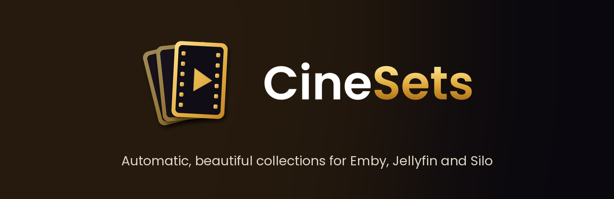

<p align="center">
  
</p>

# CineSets

[](https://github.com/blurbery/cinesets/actions/workflows/ci.yml)

CineSets builds and looks after the collections on your media server. It creates trending, streaming,
genre, best-of and franchise collections from your own library, gives every one a clean poster made from
your own artwork, and keeps the Collections page in the order you choose. After that it keeps them up to
date on a schedule, changing only what changed.

**Works with:** Emby. Jellyfin (beta). Silo (coming soon).

CineSets runs on your own machine and talks only to your own server, to mdblist.com (public lists) and,
when you ask it to, to Wikimedia Commons (streaming logos). No account, no tracking.

## What you get

- **Trending, kept current.** A Top 20 for movies and TV that refreshes every six hours (talk and news
  shows filtered out), plus full trending collections.
- **Streaming services.** Popular on Netflix, Prime Video, Disney+, HBO Max, Apple TV+, Hulu, Paramount+,
  Peacock and Stan, each with the service's logo on its poster.
- **Charts, genres and best of.** Most watched this week, new releases, popular by genre, top rated,
  award winners, best of each decade and more, from public [mdblist](https://mdblist.com) lists.
- **65 movie franchises.** Rocky & Creed, Toy Story, The Matrix, Mad Max, Indiana Jones, Halloween and many
  more, built from fixed lists of films matched by title and year, so remakes never slip in. Each is in
  release order.
- **Posters that match.** A gold section label and a bold title over the collection's own artwork. Nothing
  to design or upload.
- **One order for everyone.** Trending first, then popular, streaming, best of, kids, seasonal, regional and
  franchises A to Z, the same for every user.

## What it touches, and what it doesn't

CineSets never changes your films, shows, libraries, users or server settings. It only works on the
collections it created itself: it sets their titles, poster, name, sort title and description, and locks the
name and description (and the sort title on Emby) so the server's own metadata refresh doesn't undo them. It
never changes or deletes a collection it didn't create (unless you hand one over with `adopt`), checks a
collection still has the name it gave it before touching it, writes only what changed, and stops a run when
your server is struggling.

If your server is set to group movies into collections in the library view, films in these collections will
be grouped too, as with any collection.

## Install (Linux, next to your server)

You need Python 3.9 or newer, git, and an API key from your server (Emby or Jellyfin: Dashboard >
API Keys). On Debian or Ubuntu, install the basics first:

```bash
sudo apt install git python3-venv
```

Then:

```bash
sudo git clone https://github.com/blurbery/cinesets.git /opt/cinesets
sudo chown -R "$(id -un)" /opt/cinesets
cd /opt/cinesets
./install.sh
```

CineSets doesn't need root; any user that can write to its folder can run it. The installer sets up Python,
asks for your server address and API key (the key is hidden as you type), finds your movie and TV
libraries, downloads the streaming logos and does a dry run that changes nothing. Check `config.yml`: remove
any library you don't want used and put your main one first. When the dry run looks right:

```bash
./run.sh apply
```

Then install the schedule the installer printed. It refreshes trending every 6 hours, charts and seasonal
collections daily at 04:30, and everything on Sundays at 05:00, in the machine's own time zone.

## Docker

```bash
git clone https://github.com/blurbery/cinesets.git
cd cinesets
cp docker-compose.example.yml docker-compose.yml
```

Set `PUID` and `PGID` in `docker-compose.yml` to your user (`id -u` and `id -g`), so you can edit the files
it writes. Then:

```bash
docker compose build
docker compose run --rm cinesets setup
docker compose run --rm cinesets logos
docker compose run --rm cinesets plan
docker compose up -d
```

`setup` writes `./config/config.yml`. Inside a container, `127.0.0.1` means the container itself, so give
your server's LAN address (or its container name on a shared Docker network). `docker compose up -d` starts
the schedule from `config.yml`, and every job runs once each time the container starts. Follow it with
`docker compose logs -f cinesets`, and run any other command with `docker compose run --rm cinesets <command>`.
Changes to the collections file are picked up on the next scheduled job; restart the container
(`docker compose restart cinesets`) after you edit `config.yml`.

## Commands

| Command | What it does |
|---|---|
| `./run.sh setup` | Ask for server details, detect libraries, write `config.yml` |
| `./run.sh plan` | Dry run: what each collection would contain. Changes nothing |
| `./run.sh apply` | Create or update collections |
| `./run.sh posters` | Build posters only and save contact sheets to `data/samples` |
| `./run.sh logos` | Download streaming service logos (`--force` to download again) |
| `./run.sh list` | Show every collection key, group and name |
| `./run.sh index` | Re-read your library now (it is otherwise refreshed daily) |
| `./run.sh adopt --only KEYS` / `--all` | Take over existing collections with CineSets' names, for example after a reinstall |
| `./run.sh remove --only KEYS` / `--all` | Delete collections CineSets created (asks first, `--yes` to skip) |
| `./run.sh schedule` | Run forever on the schedule in `config.yml` (what the Docker image does) |
| `./run.sh version` | Version, licence and credit |

`plan`, `posters`, `apply`, `adopt` and `remove` take `--only m-trending,s-trending` (collection keys) or
`--group streaming` to work on part of the catalogue. `--min N` changes the fewest matches a collection needs,
except for entries that set their own `min`. Every command takes `--config path/to/config.yml`.

## Settings

`config.yml` (made by `setup`, every option explained in `config.example.yml`) holds:

- **server**: `emby` or `jellyfin`, the address and the API key.
- **libraries**: the libraries to match titles in, by their exact names on your server. The first listed
  wins when a title is in several.
- **labels**: the gold word on posters and at the start of names, for example "Movies" and "TV Shows".
- **order**: the Collections page order, top to bottom.
- **defaults**: the largest list collection and the fewest matches a collection needs to be made (8).

Environment variables override the file: `CINESETS_API_KEY`, `CINESETS_URL`, `CINESETS_SERVER` and
`CINESETS_CONFIG` (where `config.yml` lives).

## Your own collections

To customise the catalogue without blocking updates, copy it first and point CineSets at your copy:

```bash
cp collections.yml my-collections.yml     # Docker: copy it into ./config instead
```

and set `collections_file: my-collections.yml` in `config.yml`. Comment out what you don't want, or add
your own. This one uses a public mdblist list (replace the made-up `some-user/best-heist-movies` with a real
list's `user/slug`):

```yaml
  - key: m-heist
    group: bestof
    type: movie
    title: "Heist"
    subtitle: "Movies"
    accent: gold
    lists: [some-user/best-heist-movies]
```

A franchise uses a fixed list of films instead. Small franchises need `min`, because a collection is only
made once it has at least `defaults.min_items` (8) matches:

```yaml
  - key: m-karatekid
    group: universes
    type: movie
    title: "The Karate\nKid"
    accent: red
    min: 2
    titles:
      - ["The Karate Kid", 1984]
      - ["The Karate Kid Part II", 1986]
      - ["The Karate Kid Part III", 1989]
```

Keys must be unique. The header of `collections.yml` explains every field.

## Updating, moving and uninstalling

- **Update:** `git pull && ./install.sh`. Docker: `git pull && docker compose build && docker compose up -d`.
- **Keep `data/`** (Docker: `./config/data`). It records which collections CineSets owns. Copy it along when
  you reinstall or move between a normal install and Docker. If it is lost, run `./run.sh adopt --all` to
  take your CineSets collections back instead of making new ones.
- **Removing a collection:** `./run.sh remove --only KEY`, then take its entry out of your collections file
  so it isn't made again. Taking it out of the file alone only stops updates (for example, the Halloween
  ones after October; `remove` still works on them afterwards).
- **Uninstall:** stop the schedule first (`sudo rm /etc/cron.d/cinesets`; Docker: `docker compose down`), then
  `./run.sh remove --all` (Docker: `docker compose run --rm cinesets remove --all`) and delete the CineSets
  folder. `remove` only deletes collections CineSets created.

## Good to know

- Some lists are regional: Stan is Australian, Hulu and Peacock are US-only, and the regional group has
  Turkish movies and series. They only fill with titles you actually have, and collections with too few
  matches are skipped.
- Lists come from public mdblist lists owned by their authors. If one disappears, its collection simply
  stops changing; swap the list in your collections file.
- Jellyfin support is tested automatically on every change against Jellyfin 10.10 and 12, and is marked
  beta until more people have used it on real libraries. Reports are welcome.

## Development

```bash
python3 -m venv venv && venv/bin/pip install -r requirements-dev.txt
venv/bin/python -m pytest tests --ignore=tests/e2e
```

Every change is also tested by GitHub Actions against throwaway Emby and Jellyfin servers
(`tests/e2e/run_e2e.py`): CineSets creates a collection, shrinks it, changes nothing on a repeat run, leaves
other people's collections alone, and removes only its own.

## Licence and credit

CineSets is created by **blurbery** and is free software under the
[GNU Affero General Public License v3.0 or later](LICENSE), with additional terms under section 7 set out in
[NOTICE](NOTICE).

You can use, change and share it. If you share it or a modified version, you must do so under the same
licence and provide the source, including to people who use a modified version over a network. You must
keep the attribution "CineSets by blurbery (https://github.com/blurbery/cinesets)" in the NOTICE file,
source file headers and `cinesets version` output, and mark modified versions as changed. The licence grants
no trade mark rights in the CineSets name or logo.

The Poppins font is under the SIL Open Font License. Streaming logos are trademarks of their owners and are
downloaded to your own server, not distributed with CineSets.
