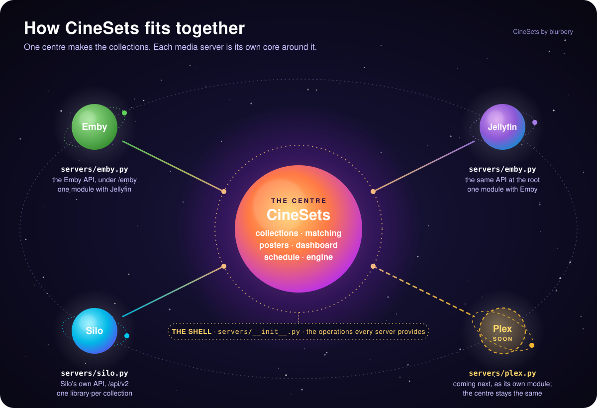

# How CineSets fits together

CineSets is built like a cluster. Everything that makes a collection good sits in the centre. Each media server is
its own core around it, and the centre only ever talks to a server through one short list of operations.
So a fix for one server can't change what another one gets, and adding a server doesn't touch the centre. Back
to the [README](../README.md).

## The centre

This is the part every server shares. It decides what each collection holds, what its poster looks like and where
it sits on the page, without knowing which server it's talking to.

| File | What it does |
|---|---|
| `collections.yml` | The catalogue: every collection, its section, its lists or franchise titles and its colours |
| `catalog.py` | Reads the catalogue and `custom-collections.yml`, and works out names, page order and sizes |
| `lists.py` | Fetches public MDBList lists, refreshing them every few hours and keeping a copy in case MDBList is down |
| `engine.py` | The library index, list matching, posters and the writes, with the safety rules: CineSets only touches collections it made, writes only what changed and backs off when a server struggles |
| `posters.py` | Draws the posters |
| `mosaic.py` | Mosaic posters: picks and keeps each one's tiles and lays out the grid of the collection's own posters |
| `logos.py` | Downloads the streaming logos onto your server |
| `scenes.py` | Made-up artwork for the docs and the dashboard's demo mode |
| `web.py`, `static/` | The dashboard |
| `cli.py`, `config.py`, `store.py` | Commands, settings and the record of what CineSets owns |

## The shell

`cinesets/servers/base.py` is the shell: the `Server` class lists every question the centre asks a server, and
nothing else. Each server module subclasses it and answers every question itself, including the ones where its
answer is "nothing to do", so no server inherits behaviour it didn't choose.

| Group | Questions |
|---|---|
| Setup | `TYPE` (its `server.type`), `KEY_PAGE`, `SETUP_NOTE`, `trim(url)` (tidy a pasted address's path) and `detect(url, verify)` (is this my kind of server, and what's its own address? no API key needed) |
| Reads | `media_libraries`, `library_folders`, `library_items`, `genres`, `alive`, `backdrop_image`, `poster_image` (a title's own poster, for mosaic posters) |
| Collections | `admin_user`, `list_collections`, `create_collection`, `wait_until_ready`, `members`, `add_items`, `remove_items`, `upload_poster`, `set_details`, `delete_collection` |
| Placement | `narrow` (which matched titles a collection can hold), `prepare` (get a collection ready before its titles change) and `arrange` (put the collections in page order after a run) |

`SERVERS` in `cinesets/servers/__init__.py` lists the server types and their names. Each type's module is
`cinesets/servers/<type>.py`, and `servers.connect(cfg)` loads only the one in `config.yml`, so an Emby install
never loads Jellyfin's, Silo's or anyone else's code. Setup is the one time CineSets asks every module, to work out
which server answers at an address.

That file also has a few helpers a module can call, such as `send`, which tries a request again after a dropped
connection or a busy answer (only when the module says the request is safe to send twice, never to make a
collection) and turns an untrusted certificate into an error that says what to do. Each module calls them itself
and passes `server.verify` with every request.

`tests/test_layout.py` keeps it that way. It fails if:

- the centre asks a server anything that isn't in the shell, under any variable name, or checks what a server has
  (`hasattr`, `getattr`);
- a server's name or API path turns up anywhere outside `cinesets/servers/`, or the centre imports a server module;
- a server module imports another server's module, or leaves any question to the base instead of answering it;
- a server is missing from setup's detection order (`ASK_ORDER`);
- loading any one server loads another.

## The servers

| | Emby: `emby.py` | Jellyfin: `jellyfin.py` | Silo: `silo.py` |
|---|---|---|---|
| API | `/emby/...`, key in `X-Emby-Token` | `/...`, key in `X-Emby-Token` and a `MediaBrowser` `Authorization` header | `/api/v2/...`, `Authorization: Bearer` with an administrator's key that has no scopes |
| A collection is | a BoxSet, shown server-wide | a BoxSet, shown server-wide | a manual library collection, in one library |
| Which titles it can hold (`narrow`) | all of them | all of them | those in its library: the first of its type in `config.yml`, or the one holding at least two thirds of its titles (an anime or an international library, say). Setup lists each type's biggest library first |
| A title is | Emby's item id | Jellyfin's item id | a Silo content id such as `movie-tmdb-105` |
| Matching ids | every provider id comes with the title | every provider id comes with the title | a content id carries one; a show's others are looked up once and kept in `data/silo-ids.json` (again after a week if some were missing) |
| A collection's titles | read without a user | read as the administrator (Jellyfin only lists them for a user) | read from the collection |
| Adding titles | 40 at a time | 40 at a time | one at a time, with a short pause between them |
| A title's own poster (`poster_image`, for mosaics) | its primary image | its primary image | the signed `poster_url` in its catalogue entry, fetched like a backdrop: the API key goes only to Silo's own address |
| Which titles have a poster | `ImageTags` in the library listing | `ImageTags` in the library listing | `poster_url` or `poster_thumbhash` on the catalogue's cards |
| Poster | uploaded as base64 | uploaded as base64 | uploaded as a file |
| Order inside a collection | `DisplayOrder` | `DisplayOrder` | a default sort: release date or title |
| Order on the page (`arrange`) | a locked sort name, so nothing to do | a sort name (Jellyfin can't lock it), so nothing to do | Silo's per-library order list, rewritten only when it changes and without moving collections CineSets didn't make |

Jellyfin began as a fork of Emby and their APIs are still close, so `jellyfin.py` started as a copy of `emby.py`.
They're kept as two modules on purpose: a fix for one server can't change what the other gets, and each can follow
its own server as the two drift apart.

Silo's Jellyfin-compatible port can show collections but can't make them, so `silo.py` uses Silo's own API.

## Adding a server

Plex is next. Adding it, or any other server, goes like this:

1. Write `cinesets/servers/<type>.py` with a class that subclasses `Server` from `base.py` and answers every
   question in it, and end the file with `SERVER = <your class>`. Start from `silo.py` if the server keeps
   collections per library (Plex does), or from `emby.py` if it speaks the Emby API.
2. Add the type and its name to `SERVERS` in `cinesets/servers/__init__.py`, and to `ASK_ORDER` so setup can
   recognise it. Setup, the `config.yml` checks and the help text pick it up from there.
3. Add unit tests with a fake server that answers the same paths as the real one (`tests/conftest.py` and
   `tests/test_silo.py` are both examples).
4. Add an end-to-end job in `.github/workflows/ci.yml` that runs CineSets against a real, throwaway server.

Nothing in the centre should need to change. If it does, the shell is missing a question: add it to `base.py`
and answer it in every module, so each server still says for itself what it does.

## How each part is tested

- **The centre, Emby and Jellyfin:** `tests/test_engine.py` and `tests/test_web.py` run against an in-memory Emby or
  Jellyfin that uses that server's real module (`emby.py` or `jellyfin.py`), so they check the exact requests each
  server gets.
- **Silo:** `tests/test_silo.py` runs the real Silo module against an in-memory Silo that follows its rules.
- **The layout:** `tests/test_layout.py`, described above.
- **Real servers:** every pull request runs CineSets end to end against throwaway Emby, Jellyfin and Silo
  servers on GitHub Actions (`tests/e2e/`). The Silo job sets up a brand-new Silo the way a new user would,
  `cinesets setup` included.
