# CineSets preview

What CineSets makes, section by section, and how the poster settings change the look. Back to the
[README](../README.md).

> [!NOTE]
> Every poster on this page is drawn by CineSets itself, but over made-up artwork, so no film stills end up in
> this repository. On your server the posters use artwork from the films and shows in your own library.
> Streaming posters show the service's name here; on your server they show its logo once you've run
> `./run.sh logos`.

## Try it in the dashboard

Everything on this page can be tried live, on your own posters, in the dashboard: `./run.sh web` (or
`./run.sh web --demo` with made-up artwork and no server). It shows each poster redrawn as you change it, lets you
drag the text into place and choose each collection's artwork, then saves to `config.yml`.

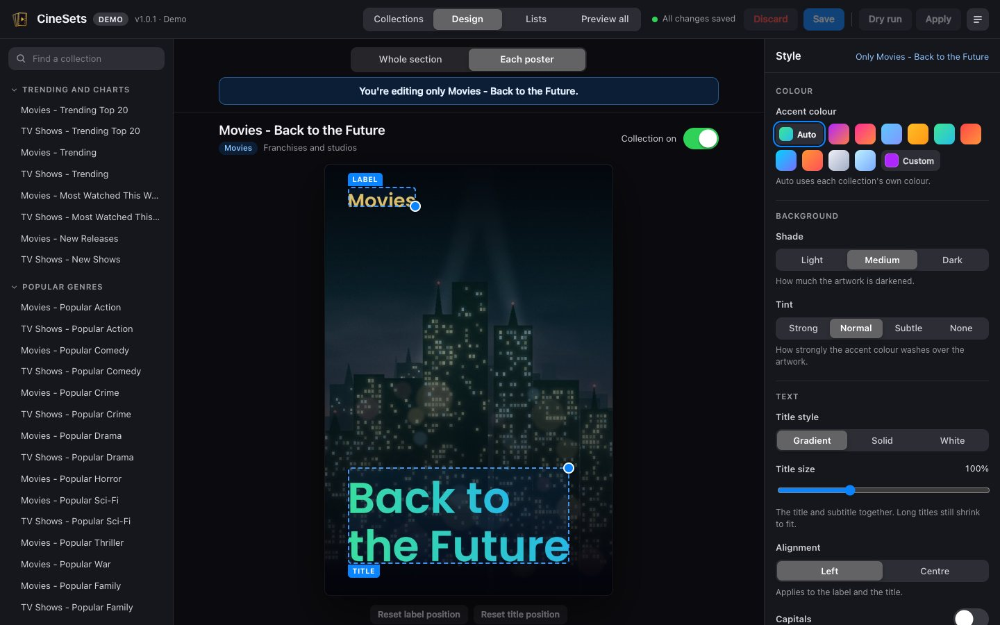

The [dashboard tour](screenshots.md) shows designing a whole section, the Collections, Lists and Preview all tabs,
and signing in.

## Your Collections page

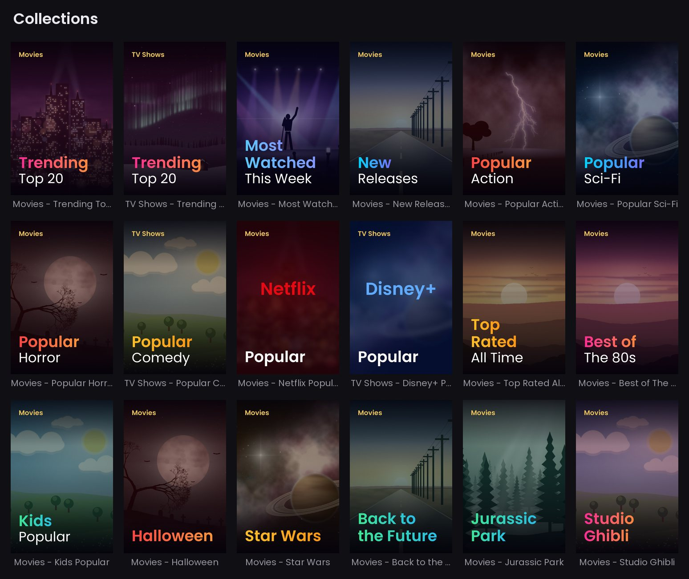

An illustration rather than a screenshot: these are real CineSets posters, laid out the way they sit on the
Collections page. Trending comes first, then the charts, genres, streaming services, best of, kids, seasonal and
the franchises from A to Z.

## Sections

The collections come in sections. Make them all (the default), pick whole sections, or pick single collections.
The easiest way is to let CineSets ask you:

```bash
./run.sh pick
```

It goes through the sections one at a time (all, none or choose) and writes your answer to `config.yml`. Nothing on
your server changes until the next `apply`. `./run.sh list` shows every section and collection key, with what's
picked. You can also edit `config.yml` by hand:

```yaml
collections:
  sections: [charts, genres, streaming, kids]   # or: all
  include: [m-oscars, m-top250]                 # single collections from other sections
  exclude: [m-stan, s-stan]                     # single collections to leave out
```

Collections CineSets already made stay on your server when you unpick them, they just stop updating.
`./run.sh remove --unpicked` deletes them.

<!-- sections:start -->

### Trending and charts

Section key `charts`, 8 collections.

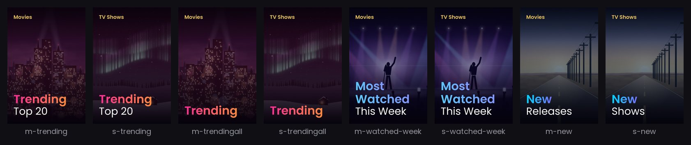

<details>
<summary>Every collection in trending and charts</summary>

| Key | Collection |
|---|---|
| `m-trending` | Movies - Trending Top 20 |
| `s-trending` | TV Shows - Trending Top 20 |
| `m-trendingall` | Movies - Trending |
| `s-trendingall` | TV Shows - Trending |
| `m-watched-week` | Movies - Most Watched This Week |
| `s-watched-week` | TV Shows - Most Watched This Week |
| `m-new` | Movies - New Releases |
| `s-new` | TV Shows - New Shows |

</details>

### Popular genres

Section key `genres`, 18 collections.

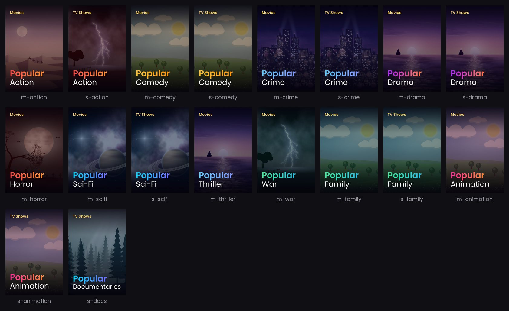

<details>
<summary>Every collection in popular genres</summary>

| Key | Collection |
|---|---|
| `m-action` | Movies - Popular Action |
| `s-action` | TV Shows - Popular Action |
| `m-comedy` | Movies - Popular Comedy |
| `s-comedy` | TV Shows - Popular Comedy |
| `m-crime` | Movies - Popular Crime |
| `s-crime` | TV Shows - Popular Crime |
| `m-drama` | Movies - Popular Drama |
| `s-drama` | TV Shows - Popular Drama |
| `m-horror` | Movies - Popular Horror |
| `m-scifi` | Movies - Popular Sci-Fi |
| `s-scifi` | TV Shows - Popular Sci-Fi |
| `m-thriller` | Movies - Popular Thriller |
| `m-war` | Movies - Popular War |
| `m-family` | Movies - Popular Family |
| `s-family` | TV Shows - Popular Family |
| `m-animation` | Movies - Popular Animation |
| `s-animation` | TV Shows - Popular Animation |
| `s-docs` | TV Shows - Popular Documentaries |

</details>

### Streaming services

Section key `streaming`, 29 collections.

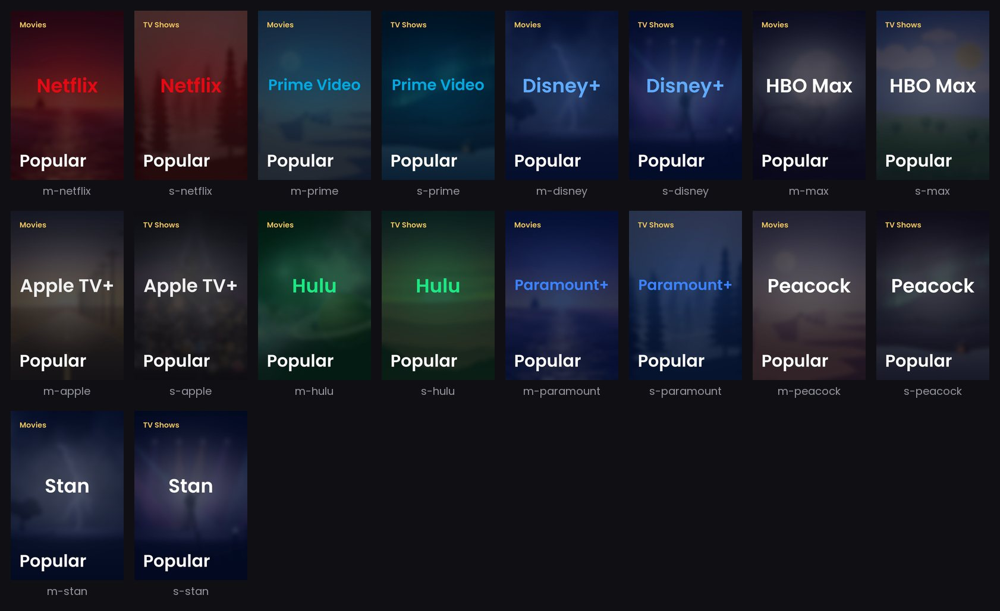

<details>
<summary>Every collection in streaming services</summary>

| Key | Collection |
|---|---|
| `m-netflix` | Movies - Netflix Popular |
| `s-netflix` | TV Shows - Netflix Popular |
| `m-prime` | Movies - Prime Video Popular |
| `s-prime` | TV Shows - Prime Video Popular |
| `m-disney` | Movies - Disney+ Popular |
| `s-disney` | TV Shows - Disney+ Popular |
| `m-max` | Movies - HBO Max Popular |
| `s-max` | TV Shows - HBO Max Popular |
| `m-apple` | Movies - Apple TV+ Popular |
| `s-apple` | TV Shows - Apple TV+ Popular |
| `m-hulu` | Movies - Hulu Popular |
| `s-hulu` | TV Shows - Hulu Popular |
| `m-paramount` | Movies - Paramount+ Popular |
| `s-paramount` | TV Shows - Paramount+ Popular |
| `m-peacock` | Movies - Peacock Popular |
| `s-peacock` | TV Shows - Peacock Popular |
| `m-stan` | Movies - Stan Now Streaming |
| `s-stan` | TV Shows - Stan Now Streaming |
| `m-binge` | Movies - Binge Now Streaming |
| `s-binge` | TV Shows - Binge Now Streaming |
| `m-iplayer` | Movies - BBC iPlayer Popular |
| `s-iplayer` | TV Shows - BBC iPlayer Latest |
| `m-itvx` | Movies - ITVX Popular |
| `s-itvx` | TV Shows - ITVX Now Streaming |
| `s-channel4` | TV Shows - Channel 4 Now Streaming |
| `m-crunchyroll` | Movies - Crunchyroll Top 100 |
| `s-crunchyroll` | TV Shows - Crunchyroll Top 100 |
| `m-shudder` | Movies - Shudder Popular |
| `s-shudder` | TV Shows - Shudder Popular |

</details>

### Best of

Section key `bestof`, 18 collections.

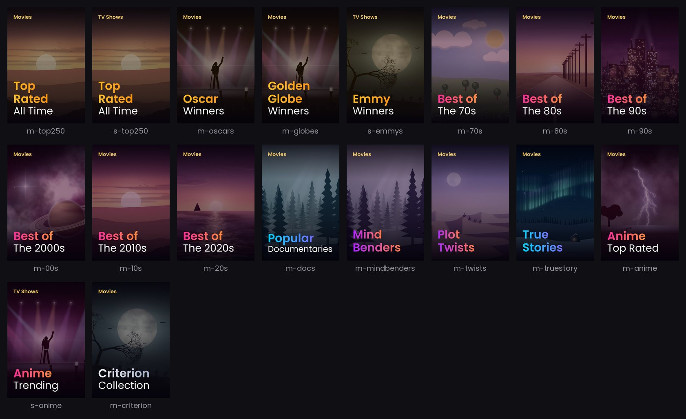

<details>
<summary>Every collection in best of</summary>

| Key | Collection |
|---|---|
| `m-top250` | Movies - Top Rated All Time |
| `s-top250` | TV Shows - Top Rated All Time |
| `m-oscars` | Movies - Oscar Winners |
| `m-globes` | Movies - Golden Globe Winners |
| `s-emmys` | TV Shows - Emmy Winners |
| `m-70s` | Movies - Best of The 70s |
| `m-80s` | Movies - Best of The 80s |
| `m-90s` | Movies - Best of The 90s |
| `m-00s` | Movies - Best of The 2000s |
| `m-10s` | Movies - Best of The 2010s |
| `m-20s` | Movies - Best of The 2020s |
| `m-docs` | Movies - Popular Documentaries |
| `m-mindbenders` | Movies - Mind Benders |
| `m-twists` | Movies - Plot Twists |
| `m-truestory` | Movies - True Stories |
| `m-anime` | Movies - Anime Top Rated |
| `s-anime` | TV Shows - Anime Trending |
| `m-criterion` | Movies - Criterion Collection |

</details>

### Kids and family

Section key `kids`, 6 collections.

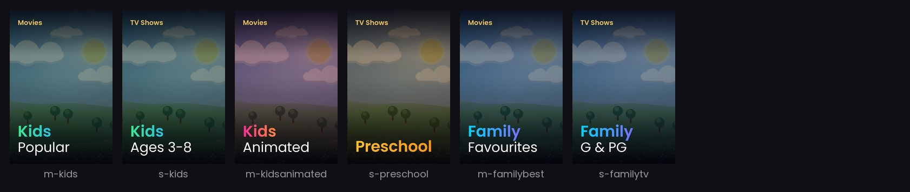

<details>
<summary>Every collection in kids and family</summary>

| Key | Collection |
|---|---|
| `m-kids` | Movies - Kids Popular |
| `s-kids` | TV Shows - Kids Ages 3-8 |
| `m-kidsanimated` | Movies - Kids Animated |
| `s-preschool` | TV Shows - Preschool |
| `m-familybest` | Movies - Family Favourites |
| `s-familytv` | TV Shows - Family G & PG |

</details>

### Seasonal

Section key `seasonal`, 6 collections.

Each one is only there around its holiday: Halloween from 1 October to 1 November, Christmas from 20 November
to 6 January. Outside those dates CineSets takes down the copy it made, and makes it again next season.

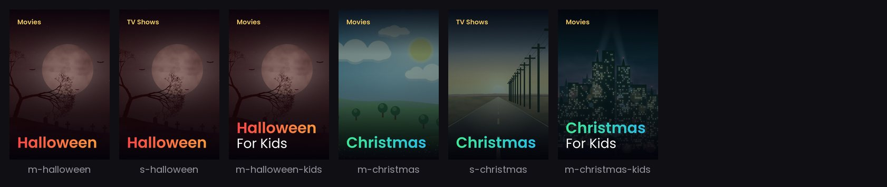

<details>
<summary>Every collection in seasonal</summary>

| Key | Collection |
|---|---|
| `m-halloween` | Movies - Halloween |
| `s-halloween` | TV Shows - Halloween |
| `m-halloween-kids` | Movies - Halloween For Kids |
| `m-christmas` | Movies - Christmas |
| `s-christmas` | TV Shows - Christmas |
| `m-christmas-kids` | Movies - Christmas For Kids |

</details>

### Regional

Section key `regional`, 8 collections.

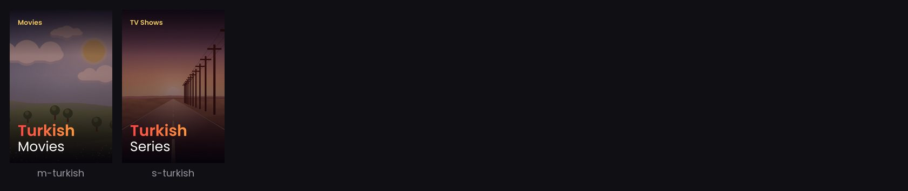

<details>
<summary>Every collection in regional</summary>

| Key | Collection |
|---|---|
| `m-turkish` | Movies - Turkish Movies |
| `s-turkish` | TV Shows - Turkish Series |
| `m-korean` | Movies - Korean Movies |
| `s-korean` | TV Shows - Korean Series |
| `m-japanese` | Movies - Japanese Movies |
| `m-indian` | Movies - Indian Movies |
| `s-british` | TV Shows - British Series |
| `s-australian` | TV Shows - Australian Series |

</details>

### Franchises and studios

Section key `universes`, 114 collections. A sample of 24 of its 114 collections.

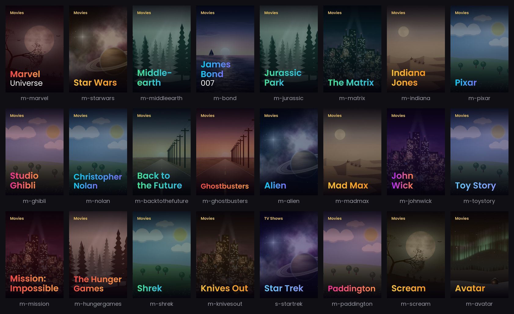

<details>
<summary>Every collection in franchises and studios</summary>

| Key | Collection |
|---|---|
| `m-28dayslater` | Movies - 28 Days Later |
| `m-anightmareonelmstreet` | Movies - A Nightmare on Elm Street |
| `m-aquietplace` | Movies - A Quiet Place |
| `m-a24` | Movies - A24 |
| `m-alien` | Movies - Alien |
| `m-americanpie` | Movies - American Pie |
| `m-austinpowers` | Movies - Austin Powers |
| `m-avatar` | Movies - Avatar |
| `m-backtothefuture` | Movies - Back to the Future |
| `m-badboys` | Movies - Bad Boys |
| `m-batman` | Movies - Batman |
| `m-beetlejuice` | Movies - Beetlejuice |
| `m-beverlyhillscop` | Movies - Beverly Hills Cop |
| `m-bourne` | Movies - Bourne |
| `m-cars` | Movies - Cars |
| `m-nolan` | Movies - Christopher Nolan |
| `m-childsplaychucky` | Movies - Chucky |
| `m-conjuring` | Movies - The Conjuring Universe |
| `m-dc` | Movies - DC Universe |
| `s-dc` | TV Shows - DC Universe |
| `m-despicable` | Movies - Despicable Me & Minions |
| `m-diehard` | Movies - Die Hard |
| `m-disneyanim` | Movies - Disney Classics |
| `m-dreamworks` | Movies - DreamWorks |
| `m-dune` | Movies - Dune |
| `m-theequalizer` | Movies - The Equalizer |
| `m-evildead` | Movies - Evil Dead |
| `m-theexpendables` | Movies - The Expendables |
| `m-fast` | Movies - Fast & Furious |
| `m-fiftyshades` | Movies - Fifty Shades |
| `m-finaldestination` | Movies - Final Destination |
| `m-fridaythe13th` | Movies - Friday the 13th |
| `m-frozen` | Movies - Frozen |
| `m-ghostbusters` | Movies - Ghostbusters |
| `m-gladiator` | Movies - Gladiator |
| `m-thegodfather` | Movies - The Godfather |
| `m-halloweensaga` | Movies - Halloween Saga |
| `m-thehangover` | Movies - The Hangover |
| `m-homealone` | Movies - Home Alone |
| `m-hoteltransylvania` | Movies - Hotel Transylvania |
| `m-howtotrainyourdragon` | Movies - How to Train Your Dragon |
| `m-hungergames` | Movies - The Hunger Games |
| `m-iceage` | Movies - Ice Age |
| `m-indiana` | Movies - Indiana Jones |
| `m-insidious` | Movies - Insidious |
| `m-jackass` | Movies - Jackass |
| `m-bond` | Movies - James Bond 007 |
| `m-jaws` | Movies - Jaws |
| `m-johnwick` | Movies - John Wick |
| `m-jumanji` | Movies - Jumanji |
| `m-jurassic` | Movies - Jurassic Park |
| `m-killbill` | Movies - Kill Bill |
| `m-kingsman` | Movies - Kingsman |
| `m-knivesout` | Movies - Knives Out |
| `m-kungfupanda` | Movies - Kung Fu Panda |
| `m-thelegomovie` | Movies - The LEGO Movie |
| `m-lethalweapon` | Movies - Lethal Weapon |
| `m-madmax` | Movies - Mad Max |
| `m-madagascar` | Movies - Madagascar |
| `m-marvel` | Movies - Marvel Universe |
| `s-marvel` | TV Shows - Marvel Universe |
| `m-matrix` | Movies - The Matrix |
| `m-themazerunner` | Movies - The Maze Runner |
| `m-meettheparents` | Movies - Meet the Parents |
| `m-meninblack` | Movies - Men in Black |
| `m-middleearth` | Movies - Middle-earth |
| `m-mission` | Movies - Mission: Impossible |
| `m-moana` | Movies - Moana |
| `m-monsterverse` | Movies - MonsterVerse |
| `m-mortalkombat` | Movies - Mortal Kombat |
| `m-themummy` | Movies - The Mummy |
| `m-nightatthemuseum` | Movies - Night at the Museum |
| `m-nowyouseeme` | Movies - Now You See Me |
| `m-oceans` | Movies - Ocean's Trilogy |
| `m-paddington` | Movies - Paddington |
| `m-paranormalactivity` | Movies - Paranormal Activity |
| `m-pirates` | Movies - Pirates of the Caribbean |
| `m-pitchperfect` | Movies - Pitch Perfect |
| `m-pixar` | Movies - Pixar |
| `m-apes` | Movies - Planet of the Apes |
| `m-predator` | Movies - Predator |
| `m-thepurge` | Movies - The Purge |
| `m-tarantino` | Movies - Quentin Tarantino |
| `m-rambo` | Movies - Rambo |
| `m-residentevil` | Movies - Resident Evil |
| `m-rocky` | Movies - Rocky & Creed |
| `m-rushhour` | Movies - Rush Hour |
| `m-saw` | Movies - Saw |
| `m-scream` | Movies - Scream |
| `m-shrek` | Movies - Shrek |
| `m-sonicthehedgehog` | Movies - Sonic the Hedgehog |
| `m-spiderman` | Movies - Spider-Man |
| `m-spykids` | Movies - Spy Kids |
| `m-startrek` | Movies - Star Trek |
| `s-startrek` | TV Shows - Star Trek |
| `m-starwars` | Movies - Star Wars |
| `s-starwars` | TV Shows - Star Wars |
| `m-ghibli` | Movies - Studio Ghibli |
| `m-supermario` | Movies - Super Mario |
| `m-taken` | Movies - Taken |
| `m-terminator` | Movies - Terminator |
| `m-terrifier` | Movies - Terrifier |
| `m-texaschainsaw` | Movies - Texas Chainsaw Massacre |
| `m-topgun` | Movies - Top Gun |
| `m-toystory` | Movies - Toy Story |
| `m-transformers` | Movies - Transformers |
| `m-tron` | Movies - Tron |
| `m-twilight` | Movies - Twilight |
| `m-underworld` | Movies - Underworld |
| `m-venom` | Movies - Venom |
| `m-wicked` | Movies - Wicked |
| `m-wizarding` | Movies - Wizarding World |
| `m-xmen` | Movies - X-Men |
| `m-zootopia` | Movies - Zootopia |

</details>

<!-- sections:end -->

## Poster style

Every setting below goes under `posters:` in `config.yml`, and every one is optional. Leave them all out and the
posters look exactly as they always have. Change one and CineSets makes the posters again on the next run and
uploads only the ones that changed.

### Looks

Some combinations to start from. Each row is one `posters:` block, shown on four collections.

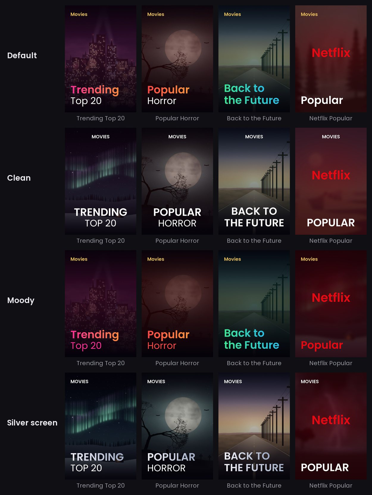

```yaml
# Clean
posters: {title: white, align: centre, case: upper, label_colour: white, tint: subtle}

# Moody
posters: {shade: dark, tint: strong, subtitle_colour: accent}

# Silver screen
posters: {accent: silver, tint: none, label_colour: white, case: upper}
```

Streaming posters keep their own artwork, logo and colours, but take the text settings (`font`, `align`, `case`,
`label`, `label_colour` and `subtitle_colour`) so they match the rest.

### Colours

Each collection has its own accent colour in `collections.yml`. `accent` sets one colour for every poster
instead: one of these, or any colour you like.

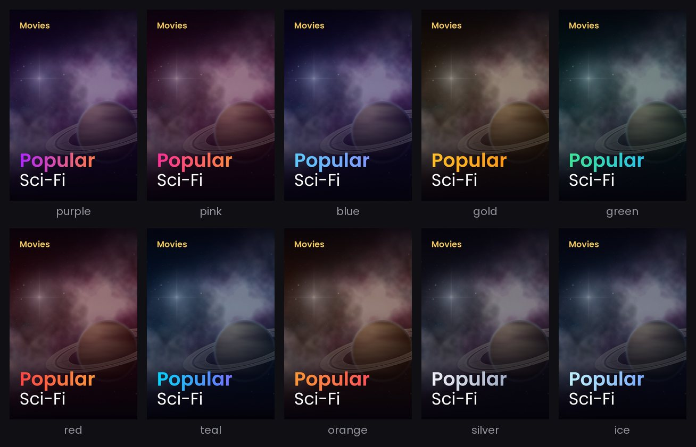

```yaml
posters:
  accent: "#ff3366"                 # one colour: the title fades into a nearby shade of it
  # accent: ["#ff3366", "#ffaa00"]  # or the title's start and end colours
```

`auto` (the default) keeps each collection's own colour. You can also give single collections a `#hex` accent
in your own collections file.

### Shade and tint

`shade` is how dark the artwork is behind the text, and `tint` is how strongly the accent colour washes over it.

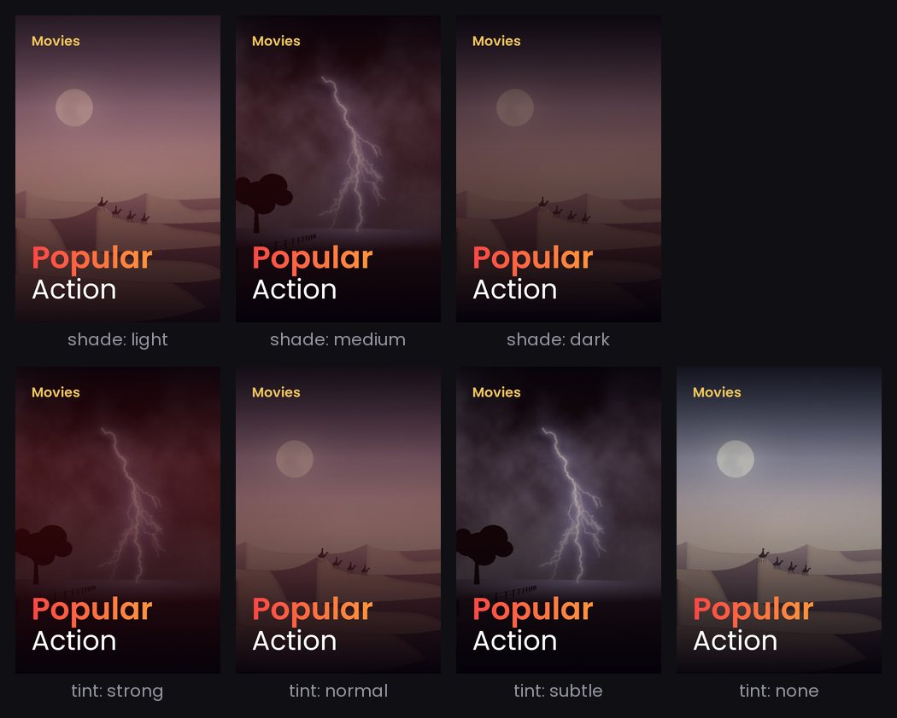

```yaml
posters:
  shade: medium   # light, medium or dark
  tint: normal    # strong, normal, subtle or none
```

### Text

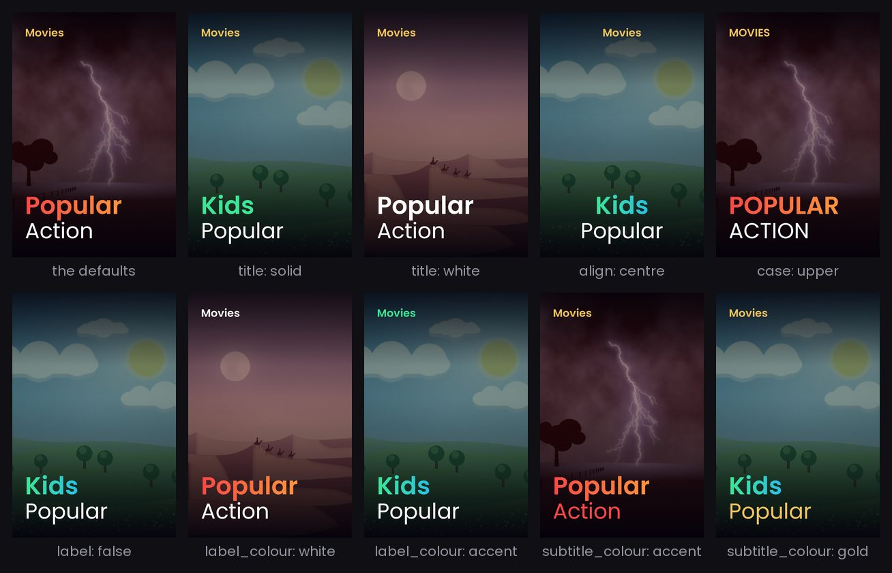

```yaml
posters:
  title: gradient          # gradient, solid or white
  align: left              # left or centre
  case: normal             # normal or upper
  label: true              # the small Movies / TV Shows label at the top
  label_colour: gold       # gold, white, accent or a colour like "#ffffff"
  subtitle_colour: white   # white, gold, accent or a colour like "#ffffff"
```

The label's words come from `labels` in `config.yml`.

### Fonts

`font` sets the font for the label, title and subtitle. Each one below is shown on a collection it suits, but any
font works on any poster.

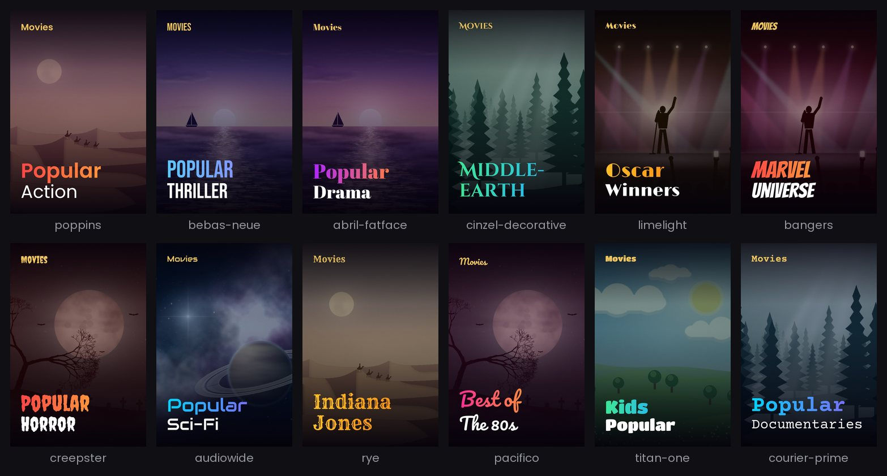

```yaml
posters:
  font: poppins          # the default
  sections:
    seasonal: {font: pacifico}
  overrides:
    m-horror: {font: creepster}
    m-scifi: {font: audiowide}
```

| Font | Feels like |
|---|---|
| `poppins` | Clean and modern, the default |
| `bebas-neue` | Tall capitals, a blockbuster or thriller |
| `abril-fatface` | Bold and classic, drama |
| `cinzel-decorative` | Carved capitals, an epic or fantasy |
| `limelight` | Art deco, old Hollywood and awards |
| `bangers` | Comic book, superheroes |
| `creepster` | Dripping, horror and Halloween |
| `audiowide` | Rounded and futuristic, sci-fi |
| `rye` | Wanted poster, westerns and adventure |
| `pacifico` | Retro script, romance and the 80s |
| `titan-one` | Round and chunky, kids and family |
| `courier-prime` | Typewriter, documentaries and true crime |

The font's name works too, like `font: Bebas Neue`. A few fonts don't have every accented letter (Creepster and
Rye have no ō or č, for example), so a poster whose text has one is drawn in Poppins instead. Each font has a
size of its own that evens out how big it looks, and long titles still shrink to fit.

## Random artwork

Out of the box, every server with the same films would get the same posters. With `artwork: random`, each
install picks its own artwork from the titles in each collection, so no two servers look alike. Streaming
posters are left alone.

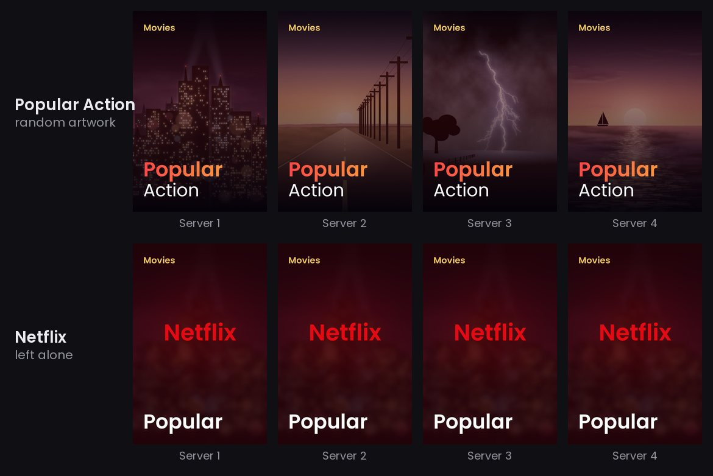

```yaml
posters:
  artwork: random   # or fixed, or mosaic (below)
```

- New installs have this switched on. Installs from before it existed keep `fixed` until they add the line, so
  updating doesn't change anyone's posters.
- A pick is kept from run to run, and changing a colour or text setting keeps the same picture.
- Tired of them? `./run.sh apply --reshuffle` picks new artwork for every collection (add `--only KEY` for just
  one).
- `backdrop_item` in your own collections file still pins a collection to one title. `backdrop_title` only
  applies with `artwork: fixed`.

## Mosaic artwork

With `artwork: mosaic`, a poster's background is a grid of the collection's own posters instead of one artwork,
with the usual shade, tint and text on top. It suits the big franchises, genres and best-of lists. Here the posters
are made-up films; on your server they're the films and shows in the collection.

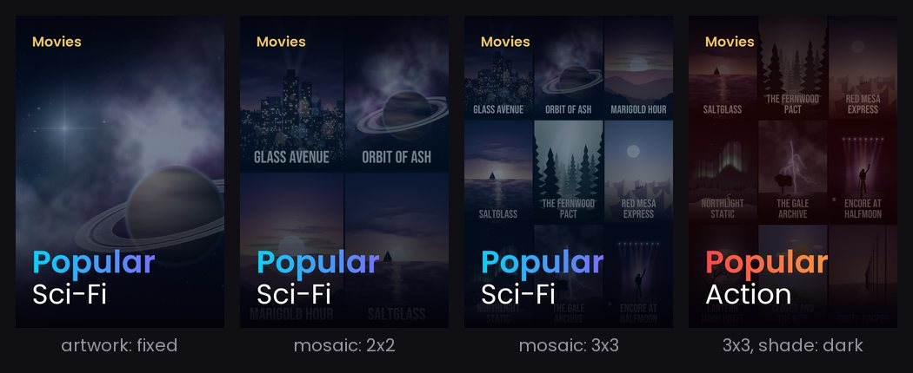

```yaml
posters:
  artwork: fixed
  sections:
    universes: {artwork: mosaic}          # every franchise
  overrides:
    m-marvel: {artwork: mosaic, mosaic: 2x2}
```

- `mosaic` is `3x3` (the default) or `2x2`. `artwork` and `mosaic` work for every poster, a section or one
  collection, like the other settings.
- The posters come from the collection's top titles. They're kept from run to run, so a list that changes order
  doesn't change the poster, and only a title that leaves the collection is replaced. `./run.sh apply --reshuffle`
  picks new ones.
- A collection with too few titles that have posters gets one artwork instead, as with `artwork: fixed`, and the
  run log says so.
- Streaming posters keep their own look, and `backdrop_item` or artwork chosen in the dashboard still wins.
- Each title's poster is downloaded once, small, into `data/tiles`.

## Making these pictures again

After changing the poster code or `collections.yml`:

```bash
venv/bin/python docs/make_preview.py
```

It draws every picture on this page and rewrites the section tables, without talking to any server. The
dashboard pictures are screenshots of `./run.sh web --demo` at 1440x900.
