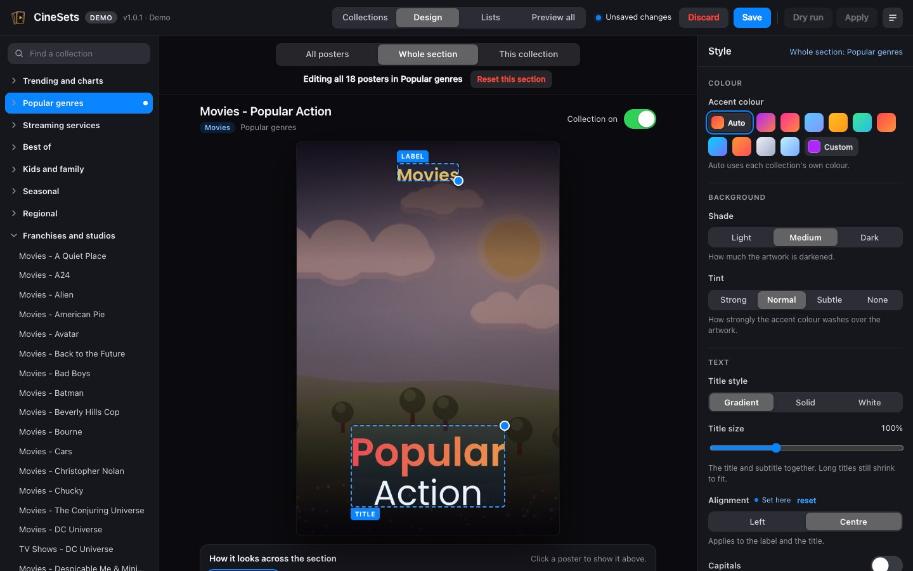
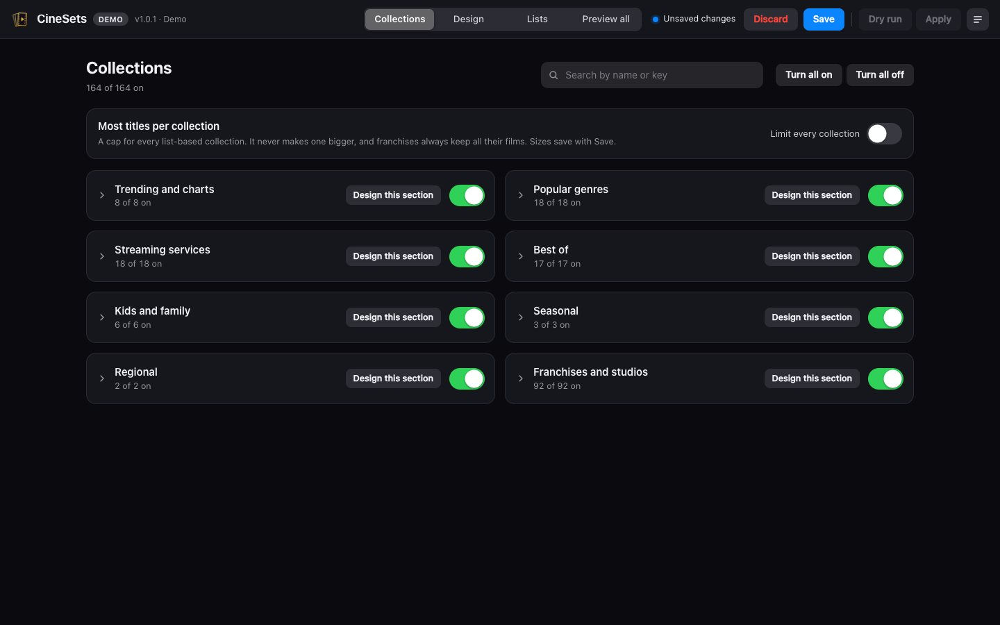
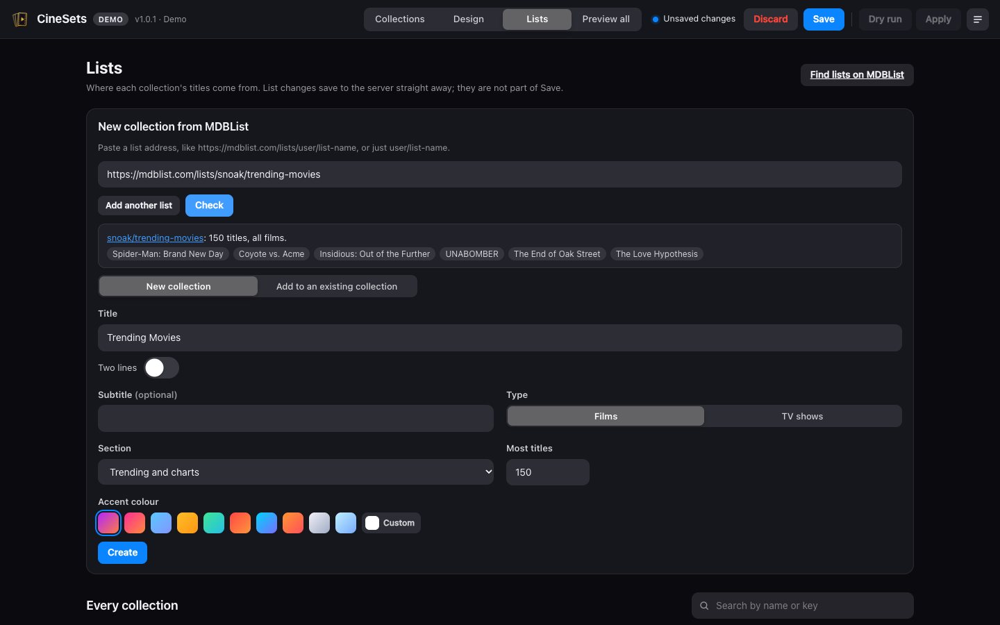
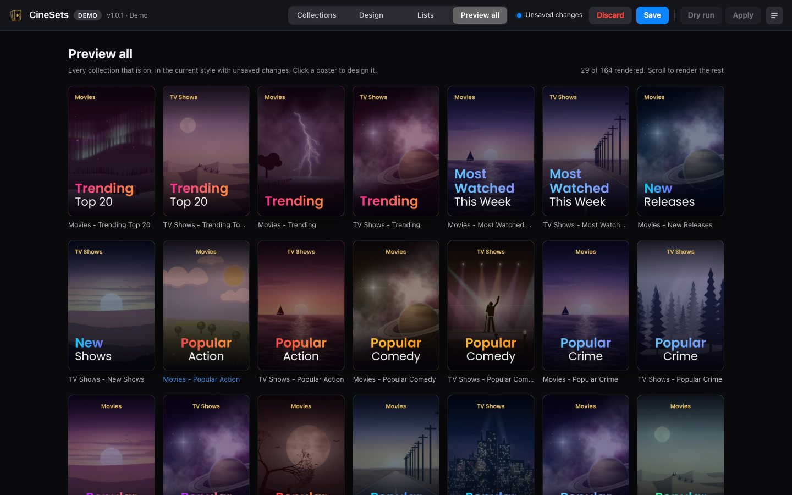
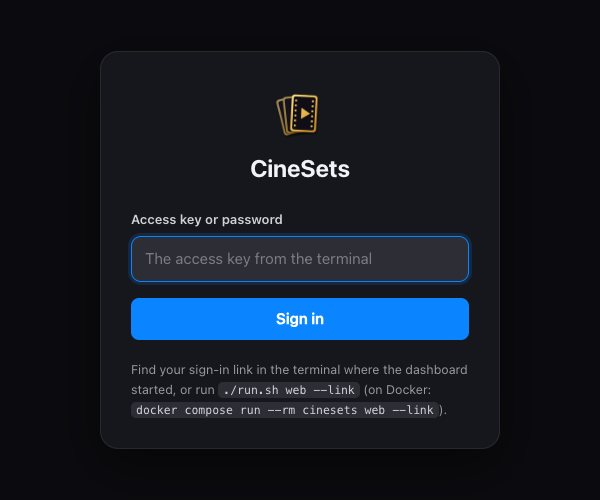

# Screenshots

What the CineSets dashboard (`./run.sh web`) looks like. Back to the [README](../README.md).

These are from `./run.sh web --demo`, which uses made-up artwork. On your own server the posters use artwork from
your library, and streaming posters show the services' logos. [docs/dashboard.md](dashboard.md) explains how to
use it, and [the preview](preview.md) shows the posters themselves, section by section.

## Design

One collection's poster, with its label and title ready to drag or resize from the corner, and the style settings
on the right.

## Designing a whole section

Every poster in Popular genres follows these settings, here with the text centred. The strip underneath shows how
it looks across the section.

## Collections

Turn sections and collections on or off, design a whole section, and set how many titles collections hold.

## Lists

Check an MDBList list, then make a new collection from it or add it to an existing one. Below are the lists
behind every collection.

## Preview all

Every collection that's on, in your style, before you save.

## Signing in

